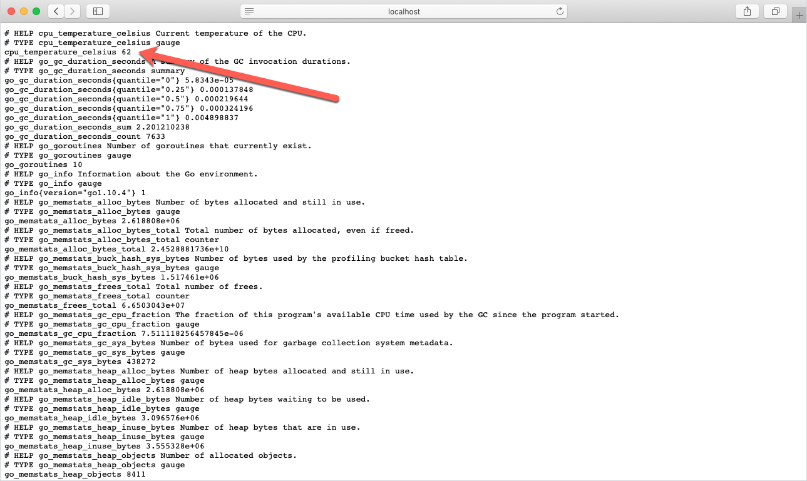
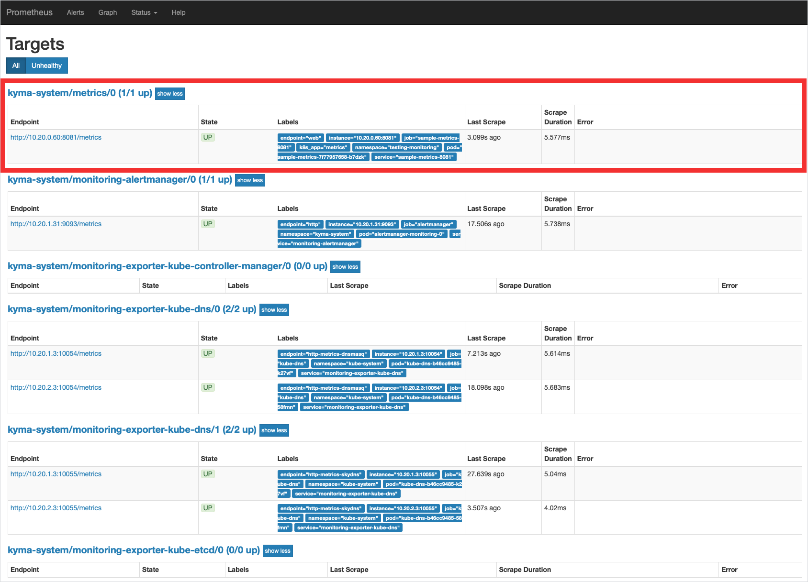

This tutorial shows how to expose custom metrics to Prometheus with a Golang service in Kyma. To do so, follow these steps:

1. Configure Istio.
2. Expose a sample application serving metrics on `8081` port.
3. Access the exposed metrics in Prometheus.

## Prerequisites

- Kyma as the target deployment environment
- Istio 0.8
  - sidecar injection enabled
  - mutual TLS enabled

## Installation

### Configure Istio

For the `default` Namespace, you must enable the sidecar injection. To enable the sidecar injection for all Pods in the `default` Namespace, run the following command:

```bash
kubectl label namespace default istio-injection=enabled
namespace "default" labeled
```

For more details on deploying your application with Istio, read [this](https://istio.io/docs/setup/kubernetes/install/) documentation.

For more details on installing the Istio sidecar, read [this](https://istio.io/docs/setup/kubernetes/additional-setup/sidecar-injection/) documentation.

The following ports are used in the Pod:

- `8080` - Envoy captures the traffic only for ports listed in Pod's **containerPorts** (`containerPort: 8080`), or in the **traffic.sidecar.istio.io/includeInboundPorts** annotation. Thus, this port is a part of the Service Mesh and can be used for application's needs.

- `8081` - This is the excluded port from the Service Mesh, which is used for exposing metrics only. The network traffic bypasses Envoy and goes straight to the container. In Kyma, use the suggested `8081` port to expose metrics.

### Expose a sample metrics application

To expose Prometheus metrics in Golang, the Prometheus community provides [this](https://github.com/prometheus/client_golang) library.

This is a basic example where `Gauge` and `Counter` metrics are exported using the `prometheus` package.

1. Deploy the sample metrics application.
    ```bash
    kubectl apply -f https://raw.githubusercontent.com/kyma-project/examples/master/monitoring-custom-metrics/deployment/deployment.yaml

    kubectl apply -f https://raw.githubusercontent.com/kyma-project/examples/master/monitoring-custom-metrics/deployment/service-monitor.yaml
    ```

    ```bash
    kubectl get pods
    NAME                             READY     STATUS    RESTARTS   AGE
    sample-metrics-67c6885d8c-smt62   2/2       Running   0          2m
    ```

2. Run the `port-forward` command on the `sample-metrics-8081` service for the`8081` port to check the metrics.
    ```bash
    kubectl port-forward svc/sample-metrics-8081 8081:8081
    ```
    Open a browser and access [`http://localhost:8081/metrics`](http://localhost:8081/metrics)

    

Find the source code for the sample application [here](https://github.com/kyma-project/examples/blob/master/monitoring-custom-metrics/main.go). See the [package prometheus](https://godoc.org/github.com/prometheus/client_golang/prometheus) for the reference documentation. Read [this](https://prometheus.io/docs/concepts/metric_types/) documentation to learn more about the Prometheus metric types.

### Access the exposed metrics in Prometheus

 Run the `port-forward` command on the `monitoring-prometheus` service:

```bash
kubectl port-forward svc/monitoring-prometheus -n kyma-system 9090:9090
Forwarding from 127.0.0.1:9090 -> 9090
Forwarding from [::1]:9090 -> 9090
```

All the **sample-metrics** endpoints appear as the [`Targets`](http://localhost:9090/targets#job-sample-metrics-8081) list.



Use either the `cpu_temperature_celsius` or `hd_errors_total` in the [**expression**](http://localhost:9090/graph) field. Click the **Execute** button to check the values scrapped by Prometheus.


### ServiceMonitor

Prometheus can reach the service using ServiceMonitor. ServiceMonitor is a specific CRD used by the Prometheus operator to monitor services.

In Kyma, the Prometheus server discovers all ServiceMonitors through the **serviceMonitorSelector** matching the `prometheus: monitoring` label.

```yaml
  serviceMonitorSelector:
    matchLabels:
      prometheus: {{ .Values.prometheusLabelValue | default .Release.Name | quote }}
{{- end }}
```

In this example, the ServiceMonitor selects a **selector** with all services matching the `k8s-app: metrics` label. Find the complete yaml [here](https://github.com/kyma-project/examples/blob/master/monitoring-custom-metrics/deployment/service-monitor.yaml).

In Kyma, there is a [template](https://github.com/kyma-project/kyma/blob/master/resources/monitoring/charts/prometheus/templates/servicemonitors.yaml) which serves to discover a list of ServiceMonitors.

### Add a Custom Dashboard in Grafana

Out of the box, Kyma includes a set of dashboards. The users can create their own **Grafana Dashboard** by using the Grafana UI. The dashboards persist even after the Pod restarts.

For details on how to create dashboards in Grafana, see the following documents:

- [Grafana in Kyma](https://github.com/kyma-project/kyma/blob/master/resources/monitoring/charts/grafana/README.md)
- [Grafana - Getting started](http://docs.grafana.org/guides/getting_started/)
- [Export and Import dashboards](http://docs.grafana.org/reference/export_import/)
- [Grafana - Dashboard API](http://docs.grafana.org/http_api/dashboard/)

### Cleanup

Run the following commands to completely remove the example and all its resources from the cluster:

1. Remove the **istio-injection** label from the `default` Namespace.
    ```bash
    kubectl label namespace default istio-injection-
    ```
2. Remove **ServiceMonitor** in the `kyma-system` Namespace.
    ```bash
    kubectl delete servicemonitor -l example=monitoring-custom-metrics -n kyma-system
    ```
3. Remove the `sample-metrics` Deployments in the `default` Namespace.
    ```bash
    kubectl delete all -l example=monitoring-custom-metrics
